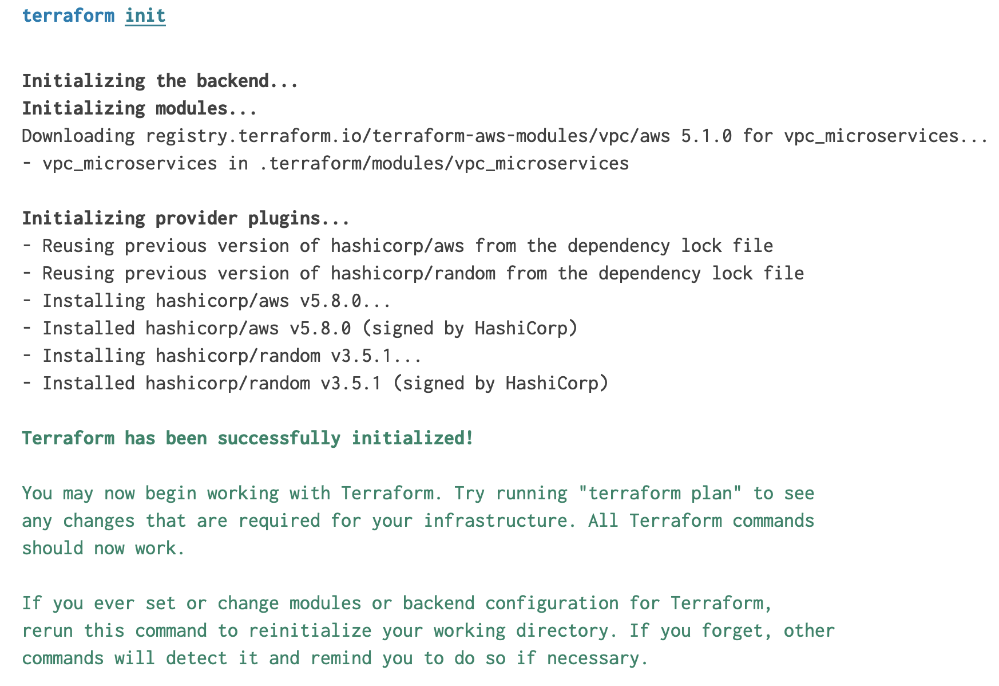
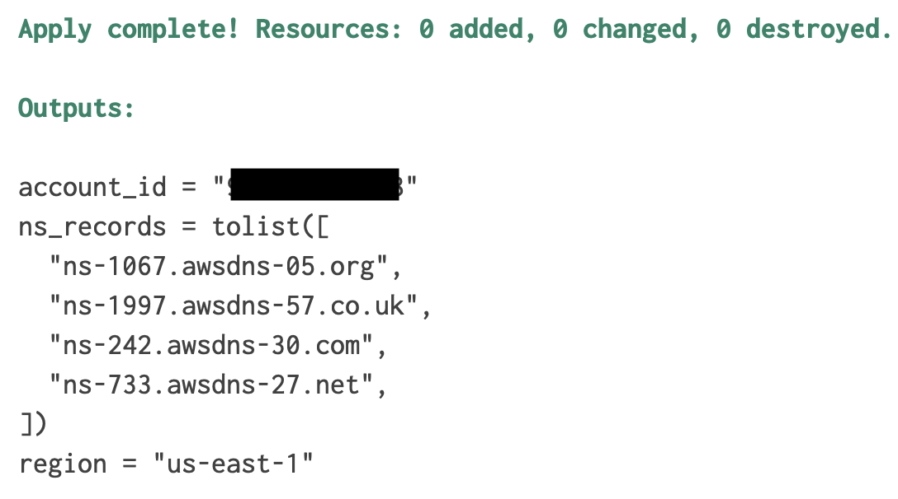
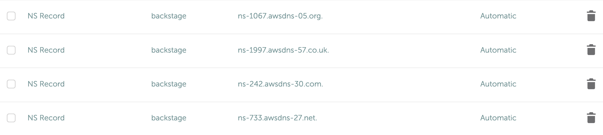
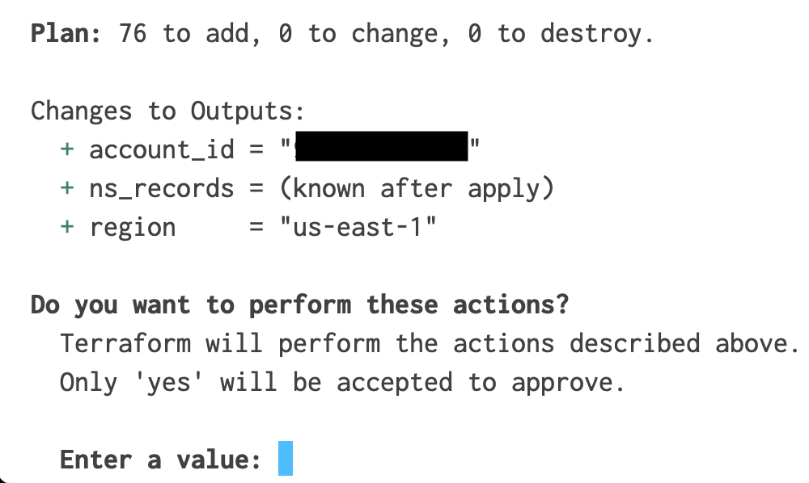
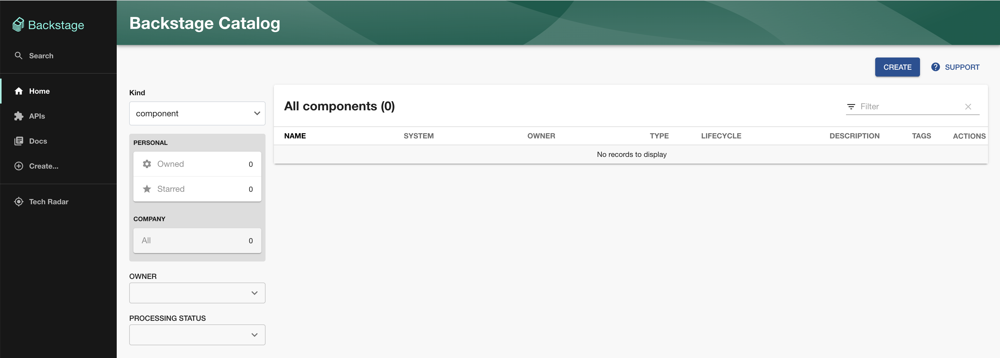

## Introduction

This repo contains the Terraform to deploy Backstage to AWS for evaluation purposes. A new VPC and associated resources are created. Backstage will be deployed to ECS in private subnets fronted by an Application Load Balancer in a public subnet. On the backend, Backstage connects to a PostgreSQL RDS instance for state management.


Please note that the instructions in this repo will enable you to use Backstage for evaluation purposes. Further investment will be required in order to implement Backstage in a production capacity. See Next Steps below for more details.

## IaC Configuration

This repository passes [checkov](https://www.checkov.io/) scans. The following checks are intentionally skipped because this is meant for temporary evaluation of Backstage:

- CKV_AWS_150: Ensure that Load Balancer has deletion protection enabled
- CKV_AWS_91: Ensure the ELBv2 (Application/Network) has access logging enabled
- CKV_AWS_139: Ensure that RDS clusters have deletion protection enabled
- CKV_AWS_324: Ensure that RDS Cluster log capture is enabled

## Requirements

In order to secure Backstage with TLS, a domain name is required. Terraform will output the AWS Nameservers, but you will need to delegate your domain to the provided Nameservers. An example is provided below.

By default, access to Backstage is limited to the IP addresses provided in the `allowed_cidr` in `apply-tfvars/dev.tfvars`. You can retrieve the IP address of your system by visiting https://checkip.amazonaws.com/.

## Docker Image

This repo uses a default Backstage image hosted by StratusGrid. You can build the image yourself running this command from the root of the project repository:

```
docker build -f packages/backend/Dockerfile
```

## Instructions

Clone this repository.

```
git clone git@github.com:StratusGrid/backstage-aws-walkthrough.git
```

[Authenticate with an AWS account](https://docs.aws.amazon.com/cli/latest/userguide/cli-chap-configure.html).

Set values for `backstage_domain_name` and `allowed_cidr` in `apply-tfvars/dev.tfvars`.

```hcl
region = "us-east-1"
env_name = "dev"
source_repo = "https://github.com/StratusGrid/backstage-aws-walkthrough"
application_name = "backstage"
docker_image = "public.ecr.aws/r1z1c0k6/backstage:latest"
vpc_cidr_octet = 10
allowed_cidr = "10.0.0.1/32"
backstage_domain_name = "mydomainname.com"
```

Run `terraform init` from the root of this repository.

_This repository has been tested with Terraform version 1.4.6. You can use [tfenv](https://github.com/tfutils/tfenv) to manage multiple versions of Terraform._

First we will need to run Terraform and target the Route 53 hosted zone, so that we can retrieve the nameservers to set in the Registrar. These are required to be in place for ACM to create the cert:

```
terraform apply -var-file apply-tfvars/dev.tfvars -target=aws_route53_zone.backstage
```

This will give you outputs similar to this:


Here's a screenshot of me setting the domain NS servers in my registrar:


Next, run the command `terraform apply -var-file apply-tfvars/dev.tfvars`.


Type `yes` to provision the resources. The resource provisioning and deployment typically takes 10-15 minutes.

The Terraform outputs will display the URL. When you click on the URL you will see Backstage.



## Next Steps

- Enable Authentication with an authentication provider, e.g. [GitHub Authentication Provider](https://backstage.io/docs/auth/github/provider/).
- Enable [GitHub Discovery](https://backstage.io/docs/integrations/github/discovery/) to automatically add repositories to the Backstage catalog.
- Author [Backstage Software Templates](https://backstage.io/docs/features/software-templates/).
- [Customize Backstage](https://backstage.io/docs/getting-started/app-custom-theme/).
- [Configure CI/CD](https://docs.aws.amazon.com/codepipeline/latest/userguide/tutorials-ecs-ecr-codedeploy.html).
- [Migrate Terraform State To Remote State](https://developer.hashicorp.com/terraform/language/settings/backends/s3).
